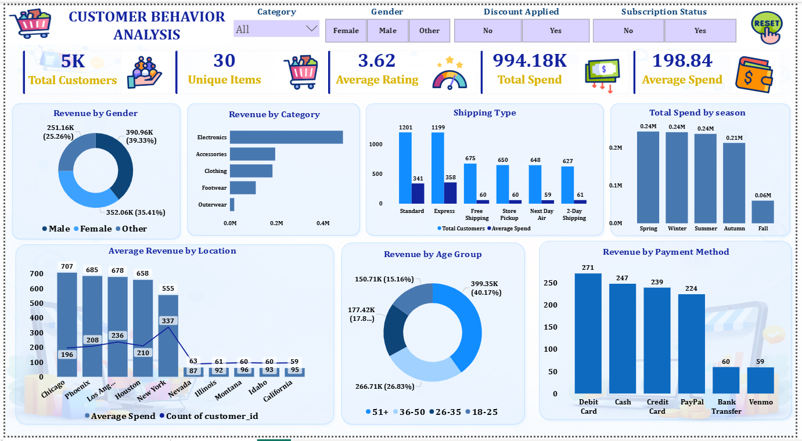
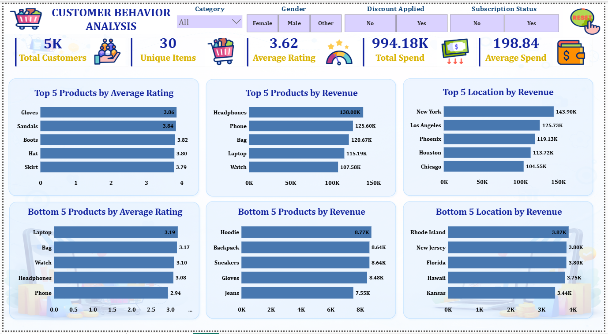

# 📊 Customer Behavior Analysis Dashboard

## 🚀 Project Overview
This project is an **end-to-end data analytics solution** built using **Python, SQL, and Power BI** to analyze customer behavior in an e-commerce environment.

It focuses on extracting actionable insights to improve:
- 📈 Revenue
- 🔁 Customer Retention
- 🎯 Marketing Effectiveness

---

## 🎯 Business Problem
Retail businesses often struggle to:
- Identify high-value customers  
- Understand purchasing patterns  
- Evaluate the effectiveness of discounts  
- Optimize product and marketing strategies  

This project addresses these challenges using data-driven insights.  
(Refer to detailed problem breakdown in project report) :contentReference[oaicite:0]{index=0}  

---

## 🛠️ Tech Stack
- **Python** → Data Cleaning & EDA (Pandas, NumPy)
- **SQL (MySQL / SQL Server)** → Data Analysis
- **Power BI** → Dashboard & Visualization

---

## 📂 Dataset Description
- **Type:** Retail / E-commerce  
- **Level:** Customer Transaction Data  
- **Features Include:**
  - Demographics (Age, Gender, Location)
  - Transactions (Purchase Amount, Frequency)
  - Product Info (Category, Item, Size)
  - Behavior (Discounts, Subscription, Payment Method)

📌 The dataset enables customer segmentation and business decision-making. :contentReference[oaicite:1]{index=1}  

---

## 🧹 Data Preprocessing (Python)
- Handled missing values using domain-specific logic  
- Fixed category inconsistencies  
- Removed duplicate customers  
- Standardized column names  
- Feature engineering for segmentation  

📌 Example:  
- Clothing → Missing size filled using mode  
- Electronics → Size marked as "Not Applicable" :contentReference[oaicite:2]{index=2}  

---

## 🗄️ SQL Analysis
Performed advanced SQL queries to answer business questions:

- Top revenue-generating categories  
- Impact of discounts on purchase value  
- Revenue by gender  
- Subscription vs non-subscription behavior  
- Customer segmentation (New / Returning / Loyal)  

📌 Example Insight:  
Electronics category contributes the highest revenue (see report page 8). :contentReference[oaicite:3]{index=3}  

---

## 📊 Power BI Dashboard

### 🔹 Dashboard 1: Overview & Trends
Includes:
- Total Customers: **5K**
- Unique Items: **30**
- Average Rating: **3.62**
- Total Spend: **~994K**
- Average Spend: **~198**

📈 Visuals:
- Revenue by Gender  
- Revenue by Category  
- Shipping Type Analysis  
- Seasonal Sales Trends  
- Revenue by Age Group  
- Payment Method Insights  

---

### 🔹 Dashboard 2: Product & Location Analysis
Includes:
- Top 5 Products by Revenue & Rating  
- Bottom 5 Products Analysis  
- Top & Bottom Locations by Revenue  

📊 Helps identify:
- High-performing products  
- Underperforming segments  
- Geographic revenue distribution  

---

## 📷 Dashboard Preview

### 🔹 Overview Dashboard

### 🔹 Product & Location Dashboard

---

## 📌 Key Insights
- 💰 Electronics is the highest revenue-generating category  
- 🎯 Discounts increase average purchase value  
- 🔁 Loyal customers contribute the majority of revenue  
- 💳 Debit cards are the most preferred payment method  
- 🌍 Certain locations (e.g., New York, LA) drive top revenue  

---

## 💡 Business Impact
This project enables businesses to:
- Identify and target high-value customers  
- Optimize discount strategies  
- Improve customer retention  
- Make data-driven marketing decisions  

---

## 📁 Project Structure
├── data/
├── notebooks/ # Python EDA & Cleaning
├── sql/ # SQL Queries
├── dashboard/ # Power BI files (.pbix)
├── images/ # Dashboard screenshots
└── README.md

---

## 🔗 Future Improvements
- Build ML models for customer prediction  
- Deploy dashboards on Power BI Service  
- Automate ETL pipeline  

---

## 👨‍💻 Author
**Kuldeep Jha**  
- GitHub: https://github.com/jha-kuldeep
- Linkedin: www.linkedin.com/in/kuldeep-jha-b3517b316  

---

⭐ If you found this project useful, consider giving it a star!
